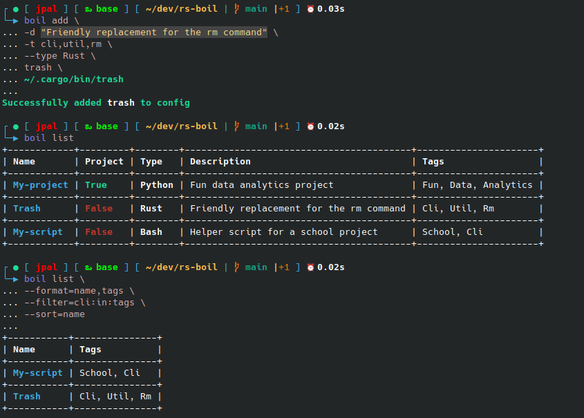

# boil

A project written in Rust to assist in keeping track of user generated scripts, and generate boilerplate code more easily. The idea being that you have a one stop shop to keep track of your current projects or a place to store info about programs already on your computer for you to reference back to or simply create a new script/project more easily.



## Installation
```bash
git clone https://github.com/jpal91/boil
cd boil
cargo install --path .
```

## Usage
```bash
# Initialize a new boil configuration to track your scripts/projects
boil init

# Create a new bash script titled my_script.sh in your assigned dev directory (can be configured)
boil new my_script.sh

# Create a new bash script in your /tmp directory
boil new -t

# Create a new python project titled my-python-proj
# Also add a brief description
boil new -T python -p -d "My python project for work" my-python-proj

# Add an existing script to the boil configuration
# Include tags that can describe the type of project
boil add --tags=util,docker my_docker_helper.py

# Add an existing util to the boil configuration with a description to remind you of what it does
boil add \
    --tags=gnu,util,disk \
    --description="Analyzes disk usage" \
    du \
    /usr/bin/du

# List all the projects you've added to the boil configuration
boil list

# List all project, filter any that have a "util" tag, sort in descending order, only show name and description
boil list \
    --filter=util:in:tags \
    --format=name,d \
    --sort=name,desc \

# Remove a script/project from the configuration
boil remove my-python-proj
```

## Development

Currently the project is in development, but is usable. Future goals are -

- [ ] Make `boil` more language agnostic, currently it only accepts 3 different program types (python, rust, bash)
- [ ] Integrate another crate for programming language detection on add
- [ ] Add ability to customize boilerplate code and/or default documents added to projects (ie custom .gitignore, LICENSE, etc.)
- [ ] Friendlier user interface for adding/creating (maybe a TUI implementation)
- [ ] Integrate an `info` command which could further integrate the commands help function, docstrings, and/or [cheats.sh](https://github.com/chubin/cheat.sh)

## Special Thanks

This program was based on a `bash` script I had already written before but I was inspired to re-implement it into a more usable model after seeing the [pier](https://github.com/pier-cli/pier) crate. A lot of the way the author implemented certain parts of the program was the basis for how I implemented mine. The biggest differences I noticed being -

1. `boil` gives the ability to sort, format, and filter your list
2. `boil` gives the ability to generate boilerplate code and actually create a script/project
3. `boil` works both with scripts and project repos while `pier` only deals with scripts and/or alias commands
